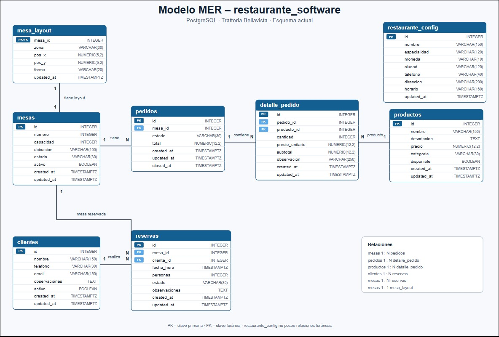

# Trattoria Bellavista — Sistema de gestión de restaurante

## 1. Descripción general

Este proyecto implementa un sistema web para administrar la operación de un restaurante. Permite gestionar mesas, clientes, reservas, pedidos, productos, cocina, configuración y reportes.

La solución está compuesta por:

- **Frontend:** React con Vite.
- **Servidor web:** Nginx.
- **Backend:** Python 3.13 con FastAPI.
- **Persistencia y validación:** SQLAlchemy 2, Pydantic y psycopg.
- **Base de datos:** PostgreSQL 16.
- **Contenedores:** Docker y Docker Compose.
- **Control de versiones:** Git y GitHub.
- **Infraestructura en la nube:** máquina virtual Ubuntu 24.04 en Microsoft Azure.




El flujo general de la aplicación es:

```text
Usuario
   ↓
React + Nginx
   ↓
API FastAPI
   ↓
PostgreSQL
```

En Azure, la aplicación se encuentra publicada mediante un nombre DNS asignado a la IP pública de la máquina virtual.

---

## 2. Arquitectura del proyecto

```text
restaurante_software/
├── backend/                 # API desarrollada con FastAPI
├── frontend/                # Frontend estático original
├── frontend-react/          # Frontend final desarrollado con React y Vite
│   ├── public/
│   ├── src/
│   │   ├── components/
│   │   ├── pages/
│   │   ├── services/
│   │   └── styles/
│   ├── Dockerfile
│   ├── nginx.conf
│   ├── package.json
│   └── vite.config.js
├── docker-compose.yml
├── .env                     # No se almacena en GitHub
└── README.md
```

### Servicios de Docker Compose

| Servicio | Tecnología | Función |
|---|---|---|
| `db` | PostgreSQL 16 Alpine | Almacena los datos del restaurante |
| `backend` | FastAPI/Python | Expone la lógica de negocio y los endpoints REST |
| `frontend` | React/Vite/Nginx | Presenta la interfaz y redirige las solicitudes de API |

### 2.1. Tecnologías

| Componente | Tecnología |
|---|---|
| Backend | Python 3.13 + FastAPI |
| ORM | SQLAlchemy 2 |
| Validación | Pydantic |
| Base de datos | PostgreSQL 16 |
| Driver PostgreSQL | psycopg |
| Frontend final | React + Vite |
| Frontend inicial | HTML5 + CSS3 + JavaScript |
| Servidor frontend | Nginx |
| Contenedores | Docker + Docker Compose |
| Documentación API | OpenAPI / Swagger |
| Control de versiones | Git + GitHub |
| Infraestructura | Microsoft Azure + Ubuntu 24.04 |

### 2.2. Arquitectura interna del backend

El backend conserva una arquitectura modular por capas:

```text
API / Routers
      ↓
Services
      ↓
Repositories
      ↓
Models
      ↓
PostgreSQL
```

Sus principales directorios son:

```text
backend/
├── app/
│   ├── api/             # Endpoints y routers
│   ├── common/          # Excepciones y elementos compartidos
│   ├── config/          # Configuración de la aplicación
│   ├── database/        # Conexión, inicialización y seed
│   ├── models/          # Modelos SQLAlchemy
│   ├── repositories/    # Acceso a datos
│   ├── schemas/         # Esquemas Pydantic
│   └── services/        # Reglas de negocio
├── .env.example
├── .dockerignore
├── Dockerfile
└── requirements.txt
```

### 2.3. Modelo funcional

```text
Cliente
   │
   └── Reserva
          │
          ▼
         Mesa
          │
          ▼
        Pedido
          │
          ▼
   DetallePedido
          │
          ▼
       Producto
```

La entidad `MesaLayout` almacena la posición, zona y forma de cada mesa utilizada en el plano interactivo.

### 2.4. Inicialización automática de la base de datos

No es obligatorio copiar una base PostgreSQL existente. En una instalación nueva se ejecuta este proceso:

```text
PostgreSQL vacío
      ↓
FastAPI inicia
      ↓
app.database.init_db
      ↓
Creación del esquema
      ↓
Carga del seed inicial
      ↓
Aplicación lista
```

`backend/app/database/init_db.py` crea el esquema mediante SQLAlchemy y carga los datos iniciales.

Una instalación limpia incluye:

- 12 mesas.
- 12 posiciones para el plano.
- Configuración inicial de Trattoria Bellavista.
- 10 productos del menú.

Las tablas de clientes, reservas, pedidos y detalles comienzan vacías. Esto permite que cada desarrollador tenga una instalación limpia y reproducible.

### 2.5. API REST disponible

#### Mesas

```http
GET    /api/mesas
GET    /api/mesas/{id}
POST   /api/mesas
PUT    /api/mesas/{id}
DELETE /api/mesas/{id}
GET    /api/mesas/{mesa_id}/pedidos
```

#### Productos

```http
GET    /api/productos
GET    /api/productos/{id}
POST   /api/productos
PUT    /api/productos/{id}
DELETE /api/productos/{id}
```

#### Pedidos

```http
GET    /api/pedidos
GET    /api/pedidos/{id}
POST   /api/pedidos
PUT    /api/pedidos/{id}/estado
POST   /api/pedidos/{id}/items
PUT    /api/pedidos/{id}/items/{detalle_id}
DELETE /api/pedidos/{id}/items/{detalle_id}
```

#### Clientes

```http
GET    /api/clientes
GET    /api/clientes/{id}
POST   /api/clientes
PUT    /api/clientes/{id}
DELETE /api/clientes/{id}
```

#### Reservas

```http
GET /api/reservas
GET /api/reservas/{id}
POST /api/reservas
PUT /api/reservas/{id}
PUT /api/reservas/{id}/estado
```

#### Layout, configuración y reportes

```http
GET /api/layout/mesas
GET /api/layout/mesas/{mesa_id}
PUT /api/layout/mesas/{mesa_id}

GET /api/configuracion/restaurante
PUT /api/configuracion/restaurante

GET /api/reportes/dashboard
GET /api/reportes/productos
```

La documentación interactiva local está disponible en:

```text
http://127.0.0.1:8000/docs
```

### 2.6. Inicio rápido local con Docker

#### Requisitos

- Git.
- Docker Desktop.

No es necesario instalar manualmente Python, PostgreSQL, FastAPI ni Nginx.

#### Clonar el repositorio

```powershell
git clone https://github.com/KeinerAstos/restaurante_software.git
cd restaurante_software
```

#### Ejecutar mediante el script del proyecto

```powershell
Set-ExecutionPolicy -Scope Process -ExecutionPolicy Bypass -Force
.\ARRANCAR_LOCAL.ps1
```

El script valida Docker, crea `.env` desde `.env.example` cuando es necesario, construye los contenedores, espera PostgreSQL, inicializa la base y levanta FastAPI y Nginx.

También se puede ejecutar directamente:

```powershell
docker compose up -d --build
docker compose ps
```

#### Direcciones locales

| Servicio | Dirección |
|---|---|
| Aplicación web Docker | `http://127.0.0.1:5500` |
| React con Vite en desarrollo | `http://127.0.0.1:5173` |
| Backend FastAPI | `http://127.0.0.1:8000` |
| Swagger / OpenAPI | `http://127.0.0.1:8000/docs` |
| Health check | `http://127.0.0.1:8000/health` |

#### Verificación de una instalación limpia

```powershell
Invoke-RestMethod "http://127.0.0.1:8000/health"
Invoke-RestMethod "http://127.0.0.1:8000/health/database"

@(Invoke-RestMethod "http://127.0.0.1:8000/api/mesas").Count
@(Invoke-RestMethod "http://127.0.0.1:8000/api/productos").Count
@(Invoke-RestMethod "http://127.0.0.1:8000/api/layout/mesas").Count
```

Resultado inicial esperado:

```text
Mesas:     12
Productos: 10
Layout:    12
```

---

## 3. Desarrollo realizado en React

### 3.1. Estructura principal

Se creó un frontend independiente en `frontend-react`. La aplicación utiliza un componente principal `App.jsx`, encargado de:

- Mostrar el menú lateral.
- Cambiar entre las diferentes páginas sin recargar el navegador.
- Verificar la conexión con FastAPI y PostgreSQL.
- Mostrar fecha y hora actuales.
- Presentar la sesión del usuario gerente.
- Mostrar un mensaje de error cuando el backend no está disponible.

Las vistas implementadas son:

- Mesas.
- Pedidos.
- Reservas.
- Menú y productos.
- Clientes.
- Cocina.
- Reportes.
- Configuración.

### 3.2. Gestión de clientes

Se implementaron las siguientes funciones:

- Consulta de clientes.
- Búsqueda por texto.
- Creación de clientes.
- Edición de datos.
- Validación de campos numéricos.
- Desactivación de clientes.
- Reactivación de clientes desactivados.
- Recarga de la tabla después de cada operación.

### 3.3. Gestión de productos y menú

El módulo permite:

- Consultar los productos registrados.
- Crear productos.
- Editar nombre, descripción, precio y demás datos.
- Activar y desactivar productos.
- Mostrar únicamente productos disponibles cuando se construye un pedido.

### 3.4. Gestión de mesas

Se implementó un plano interactivo del restaurante con áreas como terraza, salón principal, bar, recepción, cocina y zona VIP.

Las principales funciones son:

- Consultar mesas activas e inactivas.
- Crear y editar mesas.
- Mostrar capacidad, ubicación y estado.
- Reservar, liberar, habilitar y desactivar mesas.
- Abrir pedidos desde una mesa.
- Seleccionar una mesa desde el plano.
- Arrastrar mesas para modificar su posición.
- Guardar la posición mediante la API de layout.
- Filtrar por zona, número, ubicación y estado.
- Mostrar pedidos recientes y estadísticas de ocupación.

Estados utilizados:

| Estado | Significado |
|---|---|
| `LIBRE` | La mesa se encuentra disponible |
| `RESERVADA` | Existe una reserva confirmada |
| `OCUPADA` | Hay un cliente sentado y un pedido activo |
| `FUERA_DE_SERVICIO` | La mesa no está disponible para atención |

### 3.5. Gestión de reservas

El módulo de reservas permite:

- Crear y editar reservas.
- Seleccionar un cliente activo.
- Mostrar únicamente mesas disponibles.
- Validar que el número de personas no supere la capacidad.
- Confirmar o cancelar una reserva.
- Registrar que el cliente no asistió.
- Sentar al cliente y abrir automáticamente su pedido.
- Completar una reserva.
- Filtrar las reservas por estado.

Flujo utilizado:

```text
Mesa libre
   ↓
Reserva pendiente
   ↓
Reserva confirmada
   ↓
Mesa reservada
   ↓
Sentar cliente
   ↓
Reserva en mesa + pedido abierto
   ↓
Mesa ocupada
```

### 3.6. Gestión de pedidos

Se desarrolló el flujo completo para:

- Abrir un pedido asociado a una mesa.
- Consultar el detalle del pedido.
- Agregar productos.
- Modificar cantidades y observaciones.
- Eliminar elementos.
- Calcular y mostrar el total.
- Enviar el pedido a preparación.
- Marcarlo como listo, entregado y pagado.
- Cancelar pedidos.
- Separar pedidos activos e historial.

Transiciones de estado:

```text
ABIERTO
   ↓
EN_PREPARACION
   ↓
LISTO
   ↓
ENTREGADO
   ↓
PAGADO
```

También se admite la transición a `CANCELADO` cuando corresponde.

### 3.7. Tablero de cocina

El módulo de cocina se construyó como un tablero de comandas dividido en tres columnas:

- Pendientes.
- En preparación.
- Listos.

Cada comanda muestra:

- Número del pedido.
- Número de mesa.
- Estado.
- Hora de creación.
- Tiempo transcurrido.
- Productos y cantidades.
- Observaciones especiales.
- Total del pedido.

La pantalla se actualiza automáticamente cada 15 segundos. Un pedido sin productos no puede enviarse a preparación; en su lugar, se muestra un botón para ir al módulo Pedidos y agregar productos.

### 3.8. Reportes

Se implementó un tablero ejecutivo con:

- Ventas del día.
- Pedidos del día.
- Ticket promedio.
- Reservas del día.
- Pedidos activos.
- Mesas ocupadas.
- Porcentaje de ocupación.
- Productos más vendidos.
- Unidades vendidas.
- Valor vendido por producto.
- Mesa más utilizada.
- Producto más vendido.

Como el endpoint principal no devolvía `pedidos_hoy`, este indicador se calcula en el frontend utilizando la fecha de creación de los pedidos.

### 3.9. Diseño visual

Se unificaron los estilos usando una identidad visual basada en verde oscuro, crema, dorado y tonos cálidos. También se agregaron:

- Tarjetas de indicadores.
- Etiquetas de estado.
- Diseño responsivo.
- Tablero visual de cocina.
- Ranking de productos.
- Barra de ocupación.
- Estados vacíos y mensajes de error.
- Adaptación para pantallas medianas y dispositivos móviles.

---

## 4. Errores encontrados y soluciones aplicadas

### 4.1. Node y NPM no reconocidos

**Problema:** PowerShell no encontraba `node`, `npm` o `npm.cmd`.

**Causa:** Node.js no estaba incluido correctamente en la variable `PATH` de la sesión.

**Solución:** Se agregó temporalmente la ruta de Node y se ejecutó NPM mediante `npm.cmd`.

```powershell
$env:Path = "C:\Program Files\nodejs;" + $env:Path
npm.cmd --prefix .\frontend-react run dev
```

### 4.2. Error `ENOENT` de NPM

**Problema:** NPM indicaba que no encontraba `package.json`.

**Causa:** El comando se estaba ejecutando desde una carpeta incorrecta.

**Solución:** Se utilizó `--prefix .\frontend-react` o se ingresó directamente a la carpeta del frontend.

### 4.3. Error de importación de páginas en Vite

**Problema:** Vite no encontraba componentes ubicados en `src/pages`.

**Causa:** La carpeta o los archivos todavía no existían, o la ruta/importación no coincidía exactamente.

**Solución:** Se creó la estructura faltante y se corrigieron los imports en `App.jsx`.

### 4.4. Validación numérica incorrecta

**Problema:** Algunos campos rechazaban valores válidos, por ejemplo `20000`.

**Causa:** La validación interpretaba incorrectamente el valor como texto o utilizaba límites inadecuados.

**Solución:** Se convirtió explícitamente el valor a número y se ajustaron las reglas de validación.

### 4.5. Modal que no aparecía o quedaba abierto

**Problema:** Los formularios de clientes, mesas o reservas no se mostraban o no se cerraban correctamente.

**Causa:** Faltaban condiciones de renderizado o sincronización con `dialog.showModal()`.

**Solución:** Se controló la apertura mediante estado y se renderizó el diálogo únicamente cuando correspondía.

```jsx
{mostrarFormulario && (
  <ReservaDialog ... />
)}
```

### 4.6. Selector de reservas permitía mesas ocupadas

**Problema:** Al crear una reserva se mostraban mesas activas, aunque algunas estuvieran ocupadas.

**Causa:** El filtro validaba únicamente `activo !== false` y no el estado de la mesa.

**Solución:** Se filtraron las mesas por estado `LIBRE`, conservando la mesa actual únicamente durante la edición de una reserva.

### 4.7. Mesa quedaba ocupada y reserva confirmada

**Problema:** Al usar “Sentar cliente”, la mesa cambiaba a `OCUPADA`, pero la reserva continuaba `CONFIRMADA`.

**Causa:** El frontend creaba primero el pedido. La creación del pedido cambiaba la mesa a `OCUPADA`; después el backend rechazaba la transición de la reserva a `EN_MESA`, porque solamente aceptaba mesas `LIBRE` o `RESERVADA`.

**Solución:** Se corrigió el orden de las operaciones:

1. Cambiar la reserva de `CONFIRMADA` a `EN_MESA`.
2. Crear el pedido.
3. Actualizar la mesa a `OCUPADA`.

Además, se canceló el pedido de prueba que había quedado abierto y se restauró el estado correcto de la mesa.

### 4.8. Pedidos vacíos en Cocina

**Problema:** Cocina mostraba pedidos con total cero y un botón bloqueado.

**Causa:** Existían pedidos abiertos sin productos.

**Solución:** Se impidió enviarlos a preparación y se añadió el botón **Ir a Pedidos para agregar productos**.

### 4.9. Caracteres dañados

**Problema:** Se mostraban textos como `preparación`, `más` o `↻`.

**Causa:** Codificación incorrecta al copiar o guardar contenido.

**Solución:** Se reemplazaron los caracteres dañados y se mantuvo UTF-8 en HTML, JavaScript y Nginx.

### 4.10. Archivo ZIP aparecía como no rastreado

**Problema:** `git status` mostraba `frontend-react-revision.zip`.

**Causa:** El ZIP de revisión estaba dentro del repositorio.

**Solución:** Se agregó el archivo a `.gitignore` y se confirmó la regla con `git check-ignore`.

### 4.11. Docker seguía usando el frontend anterior

**Problema:** Docker publicaba la carpeta `frontend` en lugar de `frontend-react`.

**Causa:** `docker-compose.yml` conservaba el contexto anterior.

**Solución:** Se cambió el contexto:

```yaml
frontend:
  build:
    context: ./frontend-react
```

### 4.12. Vite funcionaba, pero Docker necesitaba proxy

**Problema:** En desarrollo, Vite enviaba `/api` a `localhost:8000`, pero esa configuración no se aplica en producción.

**Solución:** Se creó `frontend-react/nginx.conf` para dirigir `/api` y `/health` al servicio `backend:8000` dentro de la red de Docker.

### 4.13. Consulta de PowerShell no devolvía elementos

**Problema:** Las consultas a la API parecían vacías al usar `.value`.

**Causa:** La respuesta era un arreglo y `.value` provenía de la representación de PowerShell al convertirla a JSON, no de la API.

**Solución:** Se recorrió directamente el arreglo:

```powershell
$mesas = Invoke-RestMethod http://localhost:8000/api/mesas
$mesas | Where-Object { [int]$_.numero -eq 5 }
```

### 4.14. Error 404 al descargar la llave de Docker

**Problema:** `curl` devolvió HTTP 404 durante la instalación de Docker en Ubuntu.

**Causa:** El comando se había copiado incompleto o con un carácter adicional.

**Solución:** Se validó primero la URL con `curl -I` y luego se descargó la llave mediante la URL oficial entre comillas.

### 4.15. Aplicación no accesible desde Internet

**Problema:** La aplicación respondía dentro de la VM, pero no desde el navegador externo.

**Causa:** Faltaba permitir el puerto TCP 80 en el grupo de seguridad de red de Azure.

**Solución:** Se agregó una regla de entrada `Allow-HTTP-80` en el NSG de la máquina virtual.

### 4.16. Confusión entre zona DNS y etiqueta DNS

**Problema:** Se ingresó a la sección de registros de alias DNS, aunque no se había adquirido un dominio propio.

**Solución:** Se configuró la **Etiqueta de nombre DNS** directamente sobre la IP pública de Azure, obteniendo un nombre `cloudapp.azure.com`.

---

## 5. Configuración de Docker

### 5.1. Dockerfile del frontend

El frontend se construye en dos etapas:

1. Node instala dependencias y ejecuta `npm run build`.
2. Nginx recibe los archivos generados en `dist`.

```dockerfile
FROM node:24-alpine AS build

WORKDIR /app

COPY package.json package-lock.json ./
RUN npm ci

COPY . .
RUN npm run build

FROM nginx:1.27-alpine

COPY nginx.conf /etc/nginx/conf.d/default.conf
COPY --from=build /app/dist /usr/share/nginx/html

EXPOSE 80

CMD ["nginx", "-g", "daemon off;"]
```

### 5.2. Configuración de Nginx

Nginx cumple dos funciones:

- Publicar React.
- Redirigir `/api` y `/health` a FastAPI.

El nombre `backend` funciona porque Docker Compose crea una red interna y registra cada servicio con su nombre.

### 5.3. Compilación local

```powershell
npm.cmd --prefix .\frontend-react run build
```

### 5.4. Construcción y ejecución local

```powershell
docker compose build frontend
docker compose up -d
docker compose ps
```

---

## 6. Integración con Git

Los cambios se desarrollaron inicialmente en la rama `frontend-react` y luego se integraron en `main`.

Commits principales:

```text
10dbfe8 feat: integrar reservas pedidos y tablero de cocina
79114a6 feat: desplegar frontend react con nginx y docker
f19babd merge: integrar frontend react completo
```

Estado final esperado:

```text
On branch main
Your branch is up to date with 'origin/main'.
nothing to commit, working tree clean
```

---

## 7. Despliegue realizado en Azure

### 7.1. Recurso utilizado

Se creó una máquina virtual con:

- Ubuntu Server 24.04 LTS.
- Dirección IP pública estática.
- Autenticación SSH mediante archivo `.pem`.
- Regla de entrada TCP 22 para administración.
- Regla de entrada TCP 80 para la aplicación.
- Docker Engine y Docker Compose.

### 7.2. Conexión SSH

Desde PowerShell:

```powershell
ssh -i "RUTA_DE_LA_LLAVE.pem" azureuser@IP_PUBLICA
```

La llave privada nunca debe guardarse en GitHub ni compartirse.

### 7.3. Descarga del proyecto

```bash
git clone https://github.com/KeinerAstos/restaurante_software.git
cd restaurante_software
git branch --show-current
git log --oneline -3
```

### 7.4. Variables de entorno

En la VM se creó un archivo `.env` con:

```env
DB_NAME=restaurante_db
DB_USER=restaurante_app
DB_PASSWORD=CONTRASENA_SEGURA
```

Después se protegió:

```bash
chmod 600 .env
```

### 7.5. Puertos de producción

En la copia desplegada en Azure se utilizó:

```yaml
backend:
  ports:
    - "127.0.0.1:8000:8000"

frontend:
  ports:
    - "80:80"
```

Esto evita exponer directamente FastAPI por el puerto 8000. El acceso público se realiza a través de Nginx.

### 7.6. Construcción en Azure

```bash
docker compose config --quiet
docker compose up -d --build
docker compose ps
```

### 7.7. Pruebas desde la VM

```bash
curl -I http://localhost
curl http://localhost/health
```

Respuesta esperada del backend:

```json
{
  "status": "ok",
  "application": "Restaurante Software API",
  "version": "0.1.0",
  "environment": "production"
}
```

### 7.8. DNS

Se asignó una etiqueta DNS a la IP pública. Esto permite acceder mediante un nombre similar a:

```text
http://trattoria-bellavista.eastus2.cloudapp.azure.com
```

El DNS puede comprobarse desde Windows:

```powershell
nslookup trattoria-bellavista.eastus2.cloudapp.azure.com
```

---

## 8. Operación y mantenimiento

### 8.1. Consultar contenedores

```bash
cd ~/restaurante_software
docker compose ps
```

### 8.2. Consultar registros

```bash
docker compose logs --tail=100 backend
docker compose logs --tail=100 frontend
docker compose logs --tail=100 db
```

Para observarlos continuamente:

```bash
docker compose logs -f backend
```

Salir de la visualización con `Ctrl + C` no detiene el contenedor.

### 8.3. Reiniciar los servicios

```bash
docker compose restart
```

### 8.4. Detener la aplicación sin eliminar datos

```bash
docker compose stop
```

### 8.5. Iniciar nuevamente

```bash
docker compose start
```

### 8.6. Actualizar desde GitHub

Cuando existan cambios nuevos en `main`:

```bash
cd ~/restaurante_software
git status
git pull origin main
docker compose up -d --build
docker compose ps
```

El archivo `.env` no debe ser reemplazado ni enviado al repositorio.

### 8.7. Apagar la máquina virtual

Para detener los costos de cómputo, utilizar el botón **Detener** del portal de Azure y esperar el estado:

```text
Detenida (desasignada)
```

No se recomienda usar únicamente `sudo shutdown`, porque una VM detenida pero todavía asignada puede seguir generando cobro de cómputo.

Al volver a pulsar **Iniciar**, Docker y los contenedores deberían arrancar automáticamente por la política:

```yaml
restart: unless-stopped
```

### 8.8. Persistencia de PostgreSQL

La base de datos utiliza el volumen:

```yaml
volumes:
  restaurante_postgres:
```

Los datos sobreviven a reinicios y reconstrucciones normales. No ejecutar los siguientes comandos sin un respaldo y sin comprender su impacto:

```bash
docker compose down -v
docker volume rm restaurante_software_restaurante_postgres
```

Ambos pueden eliminar definitivamente los datos almacenados.

---

## 9. Seguridad aplicada

- Credenciales almacenadas en `.env`, fuera de Git.
- Permisos `600` para el archivo `.env` en Ubuntu.
- Autenticación SSH mediante llave privada.
- PostgreSQL sin puerto público.
- FastAPI ligado a `127.0.0.1` en el host.
- Acceso web únicamente mediante Nginx.
- IP pública estática y DNS administrado por Azure.

Recomendaciones pendientes:

- Configurar HTTPS.
- Restringir el puerto SSH al origen autorizado.
- Crear copias de seguridad periódicas de PostgreSQL.
- Configurar una alerta de presupuesto en Azure.
- Revisar actualizaciones de seguridad de Ubuntu y Docker.

---

## 10. Copia de seguridad básica de PostgreSQL

Para crear un respaldo manual:

```bash
cd ~/restaurante_software
mkdir -p backups
docker compose exec -T db pg_dump \
  -U "$DB_USER" \
  -d "$DB_NAME" \
  > "backups/restaurante_$(date +%Y%m%d_%H%M%S).sql"
```

Como las variables del archivo `.env` no se cargan automáticamente en la terminal, se pueden cargar temporalmente antes del respaldo:

```bash
set -a
source .env
set +a
```

Los archivos de respaldo contienen información de la aplicación y deben protegerse.

---

## 11. Comandos rápidos de diagnóstico

```bash
# Ver estado
docker compose ps

# Probar frontend
curl -I http://localhost

# Probar API a través de Nginx
curl http://localhost/health

# Revisar backend
docker compose logs --tail=100 backend

# Revisar base de datos
docker compose logs --tail=100 db

# Ver espacio disponible
df -h

# Ver uso de Docker
docker system df
```

### 11.1. Desarrollo sin Docker

También es posible ejecutar los componentes durante el desarrollo sin reconstruir todos los contenedores.

Backend:

```powershell
cd backend
..\.venv\Scripts\python.exe -m uvicorn app.main:app --host 127.0.0.1 --port 8000
```

Frontend React:

```powershell
npm.cmd --prefix .\frontend-react run dev
```

Para esta modalidad se requiere una instancia PostgreSQL accesible y variables de entorno correctamente configuradas. Para trabajo colaborativo y demostraciones reproducibles se recomienda Docker Compose.

### 11.2. Flujo colaborativo recomendado

Un nuevo integrante puede preparar el proyecto con:

```powershell
git clone https://github.com/KeinerAstos/restaurante_software.git
cd restaurante_software

Set-ExecutionPolicy -Scope Process -ExecutionPolicy Bypass -Force
.\ARRANCAR_LOCAL.ps1
```

No es necesario entregarle manualmente una copia de PostgreSQL, porque el esquema y los datos base se generan automáticamente en una instalación limpia.

Antes de publicar cambios:

```powershell
git status
git add .
git commit -m "descripcion breve del cambio"
git push
```

Nunca se deben agregar archivos `.env`, llaves `.pem`, respaldos de producción ni contraseñas al repositorio.

---

## 12. Estado final

Al finalizar el trabajo se consiguió:

- Frontend migrado y completado en React.
- Integración real con FastAPI.
- Gestión funcional de clientes, productos, mesas, reservas y pedidos.
- Plano interactivo de mesas.
- Flujo de atención desde reserva hasta pago.
- Tablero operativo para Cocina.
- Reportes de ventas y ocupación.
- Estilos responsivos y consistentes.
- Construcción de producción con Vite.
- Publicación mediante Nginx.
- Orquestación con Docker Compose.
- Código consolidado en `main`.
- Despliegue público en Microsoft Azure.
- Base de datos persistente.
- Nombre DNS configurado.

La aplicación queda lista para demostración académica y pruebas funcionales. Para un uso productivo real se recomienda completar HTTPS, respaldos automáticos, monitoreo, gestión de usuarios y controles de seguridad adicionales.

---

## 13. Autoría y repositorio

Proyecto académico desarrollado inicialmente por **Keiner Astos** como aplicación full stack para gestión de restaurantes y ampliado colaborativamente con el frontend React, los flujos operativos, la contenerización final y el despliegue en Microsoft Azure.

Repositorio:

```text
https://github.com/KeinerAstos/restaurante_software
```
